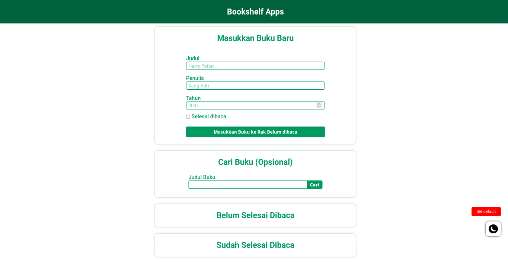

# BookshelfApps
## Introduction
BookShelf Apps is A web project that I created to submit the final project was one class in [dicoding.com](https://www.dicoding.com/). On this website I implement how to make a good website look with the use of colors and layouting in CSS and there is also the use of Javascript to make the website more interactive and the use of Web Storage to store temporary data in the user's Local Browser. So the technologist I use is as follows:
* HTML
* CSS
* Javascript
* Web Storage

## Installation
You don't have to installation this project, because you can visit [this link](https://mallexibra.github.io/bookshelfApps/)

## Usage
You can easy to use,you can visit [this link](https://mallexibra.github.io/bookshelfApps/)
1. On those website you can add a new book, when a book finished to read you can checklist the checkbox `Selesai dibaca`
2. You can look books you've finished reading or haven't finished reading
3. If you finished to read a book, you can click button `selesai` on section `Belum Selesai Dibaca` or `hapus` to delete book from website
4. If you unfinished to read a book, you can click button `belum` on section `Sudah Selesai Dibaca` or `hapus` to delete book from website
5. And last feature, you can search a book from website on section `Cari Buku (Opsional)`.
6. And additional feature, you can click button `set default` to reset data books on website and you can use Dark Mode from website with click button `dark mode`

## Showcase

This project is the final project of one of the classes in [dicoding.com](https://www.dicoding.com/) :shipit:
